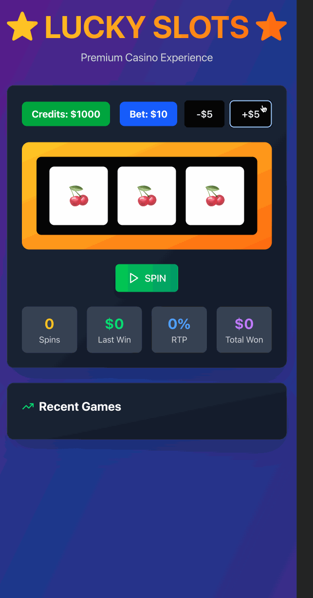

# Lucky Slots 🎰

**A premium casino slot machine experience built with modern web technologies. Features realistic gameplay mechanics, advanced animations, and comprehensive statistics tracking.**

## 🚀 Features

### Core Gaming Experience
- **Authentic Slot Machine**: Three-reel slot with staggered spinning animations that mimic real casino machines
- **Dynamic Credit System**: Start with $1000, adjustable betting from $1-$100 in $5 increments
- **Intelligent Payout Engine**: 8 unique symbols with weighted probability distribution and realistic casino odds
- **Advanced Game Controls**: Manual spin, auto-play functionality, and complete game reset capabilities

### Statistical Analysis & Tracking
- **Real-time Analytics**: Live tracking of spins, winnings, and Return-to-Player (RTP) percentages
- **Game History**: Comprehensive history of last 8 spins with visual win/loss indicators
- **Performance Metrics**: Total earnings tracking and statistical analysis for gameplay optimization

### Premium User Experience
- **Responsive Design**: Seamless gameplay across desktop and mobile devices
- **Interactive Paytable**: Live payout calculations based on current bet amount
- **Visual Feedback**: Smooth animations, win celebrations, and state-aware UI components



## 🛠 Technical Stack

- **Frontend**: React 18 with TypeScript for type-safe development
- **Styling**: Tailwind CSS with custom gradient themes and responsive utilities
- **Build Tool**: Vite for lightning-fast development and optimized production builds
- **Animation**: Custom CSS animations with React state management
- **Architecture**: Component-based design with efficient state management

## 💡 Technical Implementation

### Probability Engine
```typescript
// Weighted symbol distribution system
const symbolWeights = {
  '🍒': 25,  // Cherry - Common (25%)
  '🍋': 20,  // Lemon - Common (20%)
  '🍊': 18,  // Orange - Medium (18%)
  '🍇': 15,  // Grape - Medium (15%)
  '⭐': 12,  // Star - High (12%)
  '💎': 5,   // Diamond - Very High (5%)
  '🔔': 3,   // Bell - Premium (3%)
  '7️⃣': 2   // Lucky Seven - Jackpot (2%)
};
```

### Animation System
- **Staggered Timing**: Authentic casino reel stopping sequence
- **Performance Optimized**: Smooth animations without blocking the main thread
- **State-Driven UI**: Real-time visual feedback based on game state transitions

### Game Mechanics
- **Fair Odds System**: Mathematically balanced for engaging gameplay
- **Multiple Win Types**: Two-of-a-kind and three-of-a-kind combinations
- **Credit Management**: Automatic bet validation and balance tracking
- **RTP Calculation**: Real-time Return-to-Player percentage analysis

## 🎮 Game Features

### Betting & Payouts
- **Flexible Betting**: $1 minimum to $100 maximum in $5 increments
- **Dynamic Payouts**: Payouts scale with bet amount for consistent risk/reward
- **Instant Results**: Immediate credit updates and win calculations

### Statistical Dashboard
- **Live Metrics**: Real-time spin count, last win, and total earnings
- **Performance Tracking**: RTP percentage for strategy analysis
- **Game History**: Visual log of recent spins with outcome indicators

### User Interface
- **Modern Design**: Premium gradient themes with gold and purple accents
- **Intuitive Controls**: Clear betting controls and game state indicators
- **Mobile Optimized**: Touch-friendly interface with responsive layouts

## 🎯 Development Highlights

**Technical Achievements**:
- Built complex animation system with precise timing control
- Implemented mathematically sound probability distribution
- Created responsive design system with Tailwind CSS utilities
- Developed comprehensive state management for complex game logic
- Integrated TypeScript for enhanced code reliability and maintainability

**Problem-Solving**:
- **Animation Timing**: Solved staggered reel stopping with async/await patterns
- **Performance**: Optimized rendering for smooth 60fps gameplay
- **State Management**: Coordinated multiple game systems (betting, spinning, scoring)
- **Responsive Design**: Ensured consistent experience across device sizes
- **Game Balance**: Tuned probability weights for engaging but fair gameplay

## 🔧 Setup & Installation

```bash
# Clone the repository
git clone [repository-url]
cd lucky-slots

# Install dependencies
npm install

# Start development server
npm run dev

# Build for production
npm run build

# Preview production build
npm run preview
```

## 🌟 Technical Specifications

- **Performance**: Optimized animations for smooth gameplay on mobile devices
- **Accessibility**: Keyboard navigation and screen reader support
- **Browser Support**: Modern browsers with ES6+ support
- **Mobile First**: Responsive design from 320px to 4K displays
- **Type Safety**: 100% TypeScript coverage for reliable code

## 🎲 Symbol Probability Distribution

| Symbol | Probability | Payout Tier | Description |
|--------|-------------|-------------|-------------|
| 🍒 | 25% | Low | Common cherry |
| 🍋 | 20% | Low | Common lemon |
| 🍊 | 18% | Medium | Medium orange |
| 🍇 | 15% | Medium | Medium grape |
| ⭐ | 12% | High | High-value star |
| 💎 | 5% | Very High | Premium diamond |
| 🔔 | 3% | Premium | Premium bell |
| 7️⃣ | 2% | Jackpot | Lucky seven jackpot |

## 🏆 Game Statistics

- **RTP Target**: ~96% return-to-player for balanced gameplay
- **Win Frequency**: Approximately 1 in 3 spins result in a win
- **Jackpot Odds**: 0.008% chance for triple sevens (777)
- **Maximum Payout**: 500x bet amount for triple sevens

## 📊 Demo

Experience the slot machine: [View Demo](src/assets/LuckSlotsV4.gif)

## 📄 License

```
Copyright 2025 Rachel Bazelais

Licensed under the Apache License, Version 2.0 (the "License");
you may not use this file except in compliance with the License.
You may obtain a copy of the License at

    http://www.apache.org/licenses/LICENSE-2.0

Unless required by applicable law or agreed to in writing, software
distributed under the License is distributed on an "AS IS" BASIS,
WITHOUT WARRANTIES OR CONDITIONS OF ANY KIND, either express or implied.
See the License for the specific language governing permissions and
limitations under the License.
```

---

**Built with 🎰 by Rachel Bazelais** | Showcasing advanced React, TypeScript, and animation expertise through interactive gaming development
